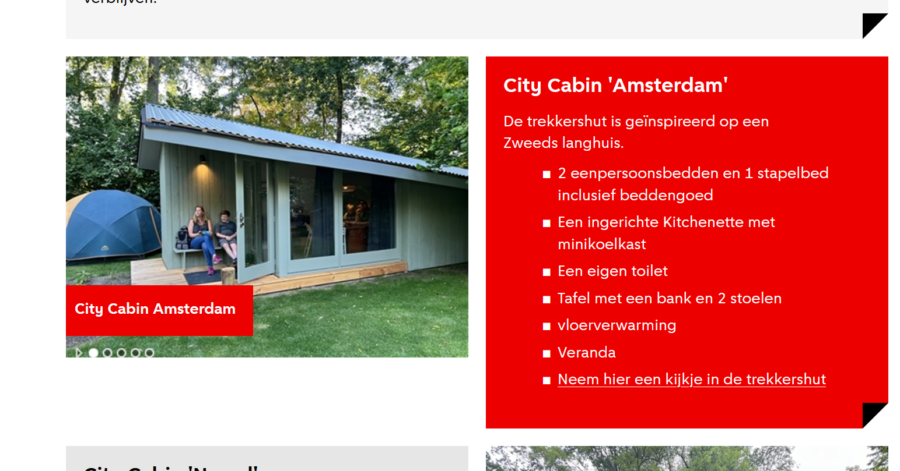
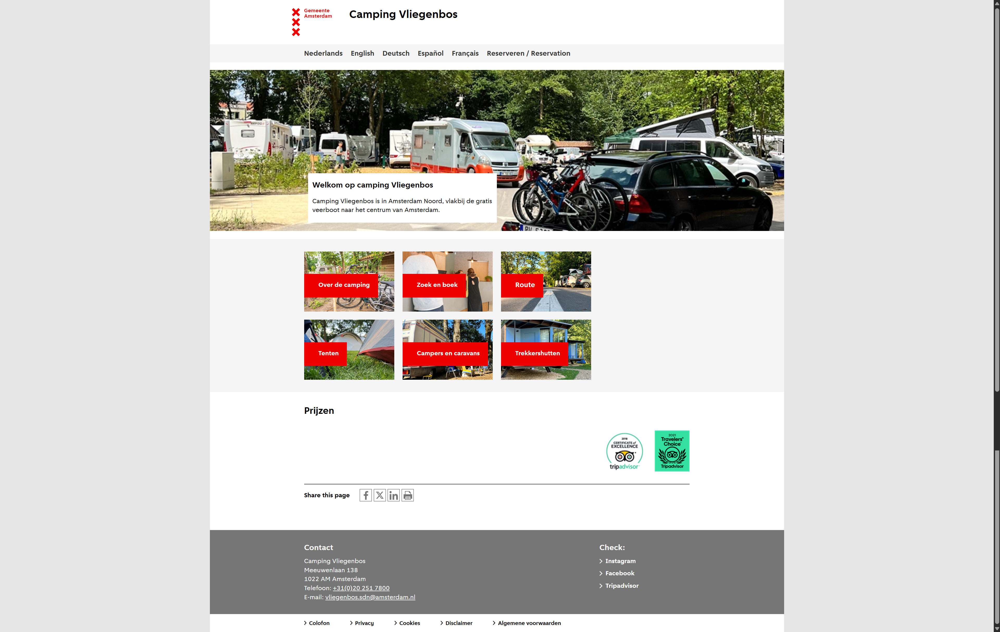
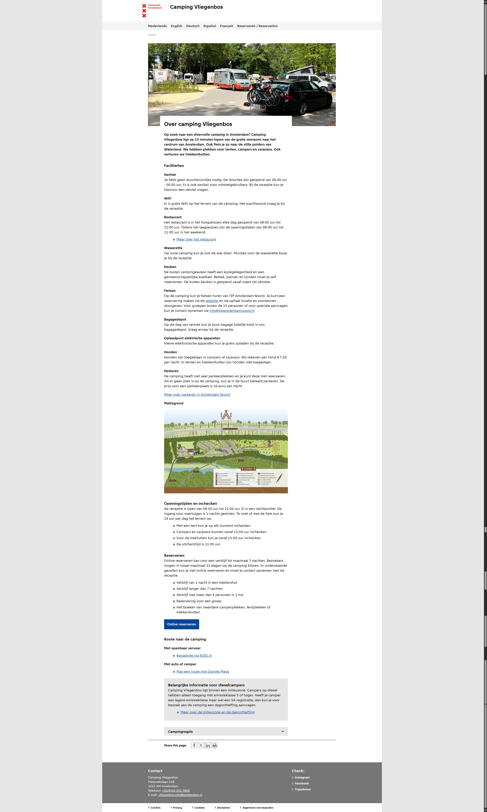

# Onderzoek Camping Vliegenbos


<div style="page-break-before: always;">&nbsp;</div>

# Table of contents

<div style="page-break-before: always;">&nbsp;</div>

# Bugs

## `<Footer>` inplaats van `<PageFooter>`

```bash
npm run add site 'Camping Vliegenbos'
```

Maakt in de `Layout.tsx` een `<Footer.MenuLink>` aan inplaats van een `<PageFooter.MenuLink>`.
Waardoor op het moment dat je begint met het project, je begint met een grote foutmelding.

**Fout**:

```tsx
  <Footer.MenuLink>{{sentenceCase name}}</Footer.MenuLink>
```

**Oplossing**

```tsx
  <PageFooter.MenuLink>{{sentenceCase name}}</PageFooter.MenuLink>
```

## `<Overlap>` zorgt voor horizontal overflow

Staat al in een issue in GitHub.

## `<ImageSlider>` zorgt voor een console error

Staat al in GitHub issue -> React versie mismatch

## `<Card>` color inverse

Je kunt geen color inverse gebruiken op een Card heading op het moment dat het een link heeft. Het kan, maar het doet niks.


## `<Card>` spacing

In de `Card` component, zit er mogelijk teveel spacing tussen de heading en de paragraph als ik gebruik wil maken van de Headinggroup.

<div style="page-break-before: always;"/>

<div style="page-break-before: always;">&nbsp;</div>

# Mogelijke problemen

## Klopt het dat de spacing hier tussen de heading en content zo groot is?


```tsx
<Grid paddingBottom="x-large">
  <Grid.Cell span={{ narrow: 4, medium: 6, wide: 8 }} start={{ narrow: 1, medium: 1, wide: 2 }}>
    <Breadcrumb>
      <Breadcrumb.Link href="/camping-vliegenbos/">Home</Breadcrumb.Link>
    </Breadcrumb>
    <Heading level={1} size="level-2">
      Route
    </Heading>
    <Paragraph className="ams-mb-s">Je kunt Camping Vliegenbos vinden aan de Meeuwenlaan 138</Paragraph>
  </Grid.Cell>
  <Grid.Cell span={{ narrow: 4, medium: 5, wide: 7 }} start={{ narrow: 1, medium: 2, wide: 3 }}>
    <div
      style={{
        // NOTE: Because the Map component loads in dynamically we need to set a min height to prevent layout shift
        minHeight: "460px",
      }}
    >
      <Map />
    </div>
  </Grid.Cell>
</Grid>
```

## `<Tabs.Panel>` geen gap tussen content

Waarom is het dat in `<Tabs.Panel>`, als er bijvoorbeeld een heading en paragraph in zit, geen spacing tussen zit? Dit los ik op met `ams-mb-s`, maar hoort er niet standaard een gap op te zitten?

Zonder gap

Met `ams-mb-s` op de heading


## `gapVertical` niet mogelijk op een `Grid.Cell`

Op het moment dat ik meerdere items in een `Grid.Cell` heb, zit er geen ruimte tussen. Dit los ik vervolgens op door de classes als `ams-mb-s`/`ams-mb-m`.

## `<Paragraph>` als `<address>`

Hoe maak ik gebruik van het [address](https://developer.mozilla.org/en-US/docs/Web/HTML/Reference/Elements/address)-html tag? Het liefst wil ik de paragraph kunnen gebruiken met een `as="address"` maar is geen optie. Op het moment dat je `<address> </address>` gebruikt, heb je geen styling.

**Voorbeeld**:

```tsx
  <Paragraph as="Address">
```

Zou het mogelijk al oplossen, hoe ik het nu heb opgelost is door:

```tsx
<Paragraph>
  Meeuwenlaan 138
  <br />
  1022 AM Amsterdam
</Paragraph>
```

Bovenstaand maakt het een p-tag, voorkeur zou zijn:

```html
<address>
  Meeuwenlaan 138<br />
  1022 AM Amsterdam
</address>
```

Misschien niet een hele grote issue, maar was wel opzoek naar hoe je dit netjes kan oplossen.

Wat ook niet de bedoeling is:

```tsx
<Paragraph>
  <address>
    Meeuwenlaan 138
    <br />
    1022 AM Amsterdam
  </address>
</Paragraph>
```

## `<Image>` gebruik imported images

We hebben een eigen image component, maar daarbij kan je geen imported image gebruiken (accepteert enkel een blob/ url).

**Voorkeur hoe te gebruiken (wat ik had verwacht)**:

```tsx
<Image src={importedImage} />
```

**Hoe het werkte met imported images**

```tsx
<Image src={importedImage.src} />
```

<div style="page-break-before: always;">&nbsp;</div>

# Missende componenten

## `<Calendar>` om een periode te selecteren

Voor een boekingsmodule best een handig component om te kunnen gebruiken.
Echter: op de camping site wordt er gebruik gemaakt van een extern boekingsmodule, al hadden we een eigen `<Calendar>`-component, had het niet uitgemaakt.

**Voorbeeld**:


Nu opgelost door met `<DateInput>` te werken.


## `<SharePage>` delen van de pagina

Op de Camping Vliegenbos website staat onder elke pagina een knop om de pagina te printen, of te delen.
Dit component mist, het kan nagemaakt worden met de `<Iconbutton />`-component, maar daardoor komen wel weer verschillende implementaties.


<div style="page-break-before: always;">&nbsp;</div>

# Vraagstukken

## `<BreadCrumbs>`

Bij het gebruik van de `<Breadcrumbs>`-component had ik het dilemma of de pagina waar je nu op zit ook erin moet staan.
Op het internet lees ik dat het nog wat verschilt of websites dit wel of niet doen.

Ik denk dat het logisch is om het niet te includen, want je hebt er normaal gesproken een heading onder, die vertelt op welke pagina je zit.
Maar als iemand bij dit dilemma kiest om het er wel bij te zetten, mist de optie om het niet klikbaar te maken. Waardoor je een `<a>` krijgt naar de pagina waar je op zit.

Lijkt me handig om dit te specificeren onder de best-practices.

## `<ImageSlider>` limitaties

### Overweging tussen grootte en de optie missen voor een Lightbox

Op bepaalde pagina's maak ik gebruik van een image slider, maar deze afbeeldingen zijn best relevant met betrekking tot de content.
Omdat een afbeelding niet groot gemaakt kan worden, heb ik de voorkeur om de sliders groot te maken (bijvoorbeeld over de gehele 12 kolommen).

Dit zorgt er alleen weer voor dat in je viewport delen van de image slider kunnen afvallen.

### Optie voor dots

Naast bovenstaande limitatie mis ik ook de optie om geen thumbnails te laten zien.
Dit zou wel een functionaliteit zijn die een verschil kan maken in een layout.

Als voorbeeld, de camping site:

Ze maken gebruik van `dots`, meerdere image sliders op een pagina. Als ik dit had gedaan, was het enorm druk geworden met afbeeldingen.
Ook hierbij zou een combinatie van dots, en het gebruikt van een Lightbox fijn zijn.

## Layout van de pagina's

Voor de eerste ontvangen feedback was ik niet op de hoogte dat pagina's die het design system gebruikte een indeling hadden als:

1. Heading
2. Paragraph
3. Image
4. Content

Dit zou ik echter wel hebben kunnen zien onder de `article` page voorbeeld.

<div style="page-break-before: always;">&nbsp;</div>

# Gemaakte keuzes

## Navigatie

| Versie             | Opties                                               | Toelichting                                                       |
| ------------------ | ---------------------------------------------------- | ----------------------------------------------------------------- |
| Camping Vliegenbos | Nederlands, Engels, Duits, Spaans, Frans, Reserveren | Onder elke taal de 6 pagina's                                     |
| Prototype v1       | Reserveren, big menu > talen > pagina's              | Nadruk gelegd op het reserveren, talen wel meegenomen in het menu |
| Prototype v2       | Reservere, big menu > pagina's                       | Talen eruit gehaald, omdat deze niet worden gerealiseerd          |

**Camping Vliegenbos website**:


**Prototype v1**:

**Prototype v2**:

> TODO: Plaatsen screenshot

## Home

**Camping Vliegenbos**


**Prototype v1**


### Algemene keuzes

1. Prijzen sectie eruit gehaald, dit werkte niet op de website.
2. Idee omtrent tekst over afbeelding behouden, al ben ik hier het misnt tevreden over. Voelt wat lomp vergeleken met de rest.
3. De blokken leken me het meest vanzelfspreken om over te zetten naar `Cards`, dan zelf moeilijk te gaan doen met tekst over de afbeelding. Ook zou ik zeggen dat het gebruik van `Cards` hier goed van toepassing komt.

### Keuzes omtrent layout

1. In de eerste versie was de kolombreedte van de cards over de gehele breedte, na ontvangen feedback van Vincent heb ik dit omgezet naar:

```tsx
<Grid.Cell span={{ narrow: 4, medium: 5, wide: 10 }} start={{ narrow: 1, medium: 2, wide: 2 }}>
  <Grid>
    {cards.map((card, idx) => (
      <Grid.Cell span={4} key={`${idx}-card`}>
        <Card>
          <Card.Image alt="" src={card.img.src} />
          <Card.Heading level={4}>
            <Card.Link href={card.href}>{card.label}</Card.Link>
          </Card.Heading>
        </Card>
      </Grid.Cell>
    ))}
  </Grid>
</Grid.Cell>
```

2. Verder is de layout behouden.

## Over de Camping

**Camping Vliegenbos**


**Prototype v1**


### Algemene keuzes

1. De content opnieuw in te richten in secties, om het overzichtelijker te maken
2. Openingstijden, faciliteiten, en plattegrond in tabjes.
3. Nadruk gelegd op het reserveren, en vervolgens pas de route laten zien met de campingregels.
4. Campingregels ingedeeld is in aparte kopjes binnen een accordion, zodat het niet 1 lange lijst aan punten is.

### Keuzes omtrent layout

1. Kolombreedtes aangehouden zoals vermeld staat in de guidelines van het ADS.
2. `<Spotlight>` gebruikt om nadruk te leggen op belangrijke informatie (en om de content minder als 1 lang stuk te laten aanvoelen).
3. `<Tabs>` gebruikt om niet alle informatie altijd te laten zien, de keuze aan de gebruiker gelaten welke content voor hen belangrijk is.

## Zoek en boek

**Camping Vliegenbos**

**Prototype v1**
    

### Algemene keuzes

1. Op de Camping-website maken ze gebruik van een filterbar, ik had deze eerst proberen na te maken, maar daar waren de componenten te groot voor, en het werdt er niet beter van. Ik heb ervoor gekozen om dit om te zetten in verschillende stappen.
2. API ge-reverse-engineered om het te implementeren in het prototype.
3. 1 vraag per pagina om de UX sterk te houden ([one primary action per screen](https://principles.design/examples/principles-of-user-interface-design))
4. Op de camping website had je enkel de optie om vervolgens naar de reseveren pagina te gaan, ik heb een dynamische pagina gemaakt dat de gebruiker kan doorklikken naar de hut.
5. Geen gebruik gemaakt van breadcrumbs op advies van het ADS (zodat de gebruiker niet er vanuit gaat dat het een progress indicator betreft)

### Keuzes omtrent layout

1. Kolombreedtes aangehouden zoals staat in de guidelines van de ADS
2. Grid bij resultaten van 3 resulten per row, dit naar aanleiding van het ADS (3 of 4 kolommen), 4 werdt te klein, 3 werkte goed.
3. Nog niet helemaal tevreden over de pagina van de hut, deze ga ik nog verbeteren, maar voor nu ook de kolombreedtes geprobeerd aan te houden uit de guidelines van het ADS.

## Route

Camping Vliegenbos Nvt verwijst naar Google Maps

**Prototype v1**


### Algemene keuzes

1. Op de Camping-website gaat deze pagina direct naar Google Maps
2. Gekozen om hier een pagina van te maken omdat de Gemeente Amsterdam normaal niet meteen verwijst naar Google Maps
3. Gebruik gemaatk van [Leafletjs](https://leafletjs.com/) met de [Amsterdam layer](https://developer.amsterdam.nl) er overheen

### Keuzes omtrent layout

> Valt me op dat ik hier niet echt goed gebruik heb gemaakt van de kolommen, dit ga ik nog oppakken

## Tenten

**Camping Vliegenbos**

Prototype v1


### Algemene keuzes

1. Gekozen om een overlap te gebruiken met een spotlight om de content vloeiender door te laten lopen. Meer een geheel van te maken.
2. Gerelateerde informatie in tabjes opgedeeld om ruimte te besparen

### Keuzes omtrent layout

1. Kolombreedtes aangehouden uit guidelines ADS
2. Omdat deze pagina erg op de Campers en caravans pagina lijkt heb ik gekozen voor de overlap, omdat ik dit ook nog is van kleur kan aanpassen en het zo meer kan laten voelen als aparte pagina's van elkaar.

> Valt me op dat ik hier nog wat vreemd om ga met spacings, erg krap, dit ga ik nog verhelpen.

## Campers en caravans

**Camping Vliegenbos**

**Prototype v1**


### Algemene keuzes

1. Gekozen om een overlap te gebruiken met een spotlight om de content vloeiender door te laten lopen. Meer een geheel van te maken.
2. Gerelateerde informatie in tabjes opgedeeld om ruimte te besparen
3. De `Alert` vond ik passen bij de content in de overlap/spotlight. Er stond niet dat dit niet de bedoeling was, en had wel het idee dat het kon (al ziet het er misschien wat vreemd uit).

### Keuzes omtrent layout

1. Kolombreedtes aangehouden uit guidelines ADS
2. Omdat deze pagina erg op de Tenten pagina lijkt heb ik gekozen voor de overlap, omdat ik dit ook nog is van kleur kan aanpassen en het zo meer kan laten voelen als aparte pagina's van elkaar.

> Valt me op dat ik hier nog wat vreemd om ga met spacings, erg krap, dit ga ik nog verhelpen.

## Trekkerhutten

Camping Vliegenbos

Prototype v1


### Algemene keuzes

1. De Camping Vliegenbos website maakt gebruik van allerlei image sliders op deze pagina. Opzich is het nog wel duidelijk, en ik heb dit eerst proberen na te maken. Alleen omdat de `ImageSlider` thumbnails eronder heeft werdt dit echt te druk.
2. Door punt 1 heb ik dan ook besloten om de trekkershutten op te splitten onder losse pagina's, en vanaf deze pagina daar met Cards naar toe te verwijzen.

### Keuzes omtrent layout

> Valt me op dat me spacing hier krap is. Hiernaast zijn mijn `Cards` erg breedt.

### Subpagina's

**Camping Vliegenbos**
nvt

**Prototype v1**


### Algemene keuzes

1. Gekozen om hier op de losse sub pagina gebruik te maken van de `<ImageSlider>`, omdat we hier de ruimte ervoor hebben (al heb ik het hier wel erg groot).
2. Op de Camping Vliegenbos website hebben we een linkje naar Google Maps met een speciaal gemaakte StreetView idee. Ik heb dit nu met een iframe geimplementeerd.

### Keuzes omtrent layout

> Ziet er nog wat lomp uit, eerst nog een iteratie hierover.

<div style="page-break-before: always;">&nbsp;</div>

# Opmerkingen

## Optimalisaties uit frameworks

Hoe kan er gebruik worden gemaakt van frameworks (als Next.js) ingebouwde image optimalisatie technieken in de image component, binnen het design system?

Begrijp dat dit technisch lastig is omdat het niet gebouwd wordt specifiek voor Next.js, maar als er wordt gewerkt binnen een project met een bepaald framework lijkt me dit een grote wens.

Zelfde voor Link componenten etc, zou hier technisch gezien geen oplossing voor mogelijk zijn?
Zulke optimalisaties uit frameworks zijn volgens mij steeds vaker de standaard, en kunnen ook wel een verschil maken in de performance van een website (prefetching etc.)

## Hoe werkt het met bold tekst? Liever niet?

In de camping site wordt bij de introductie gebruik gemaakt van bold. Is wat onnodig, maar ik kon hier niet echt iets over het vinden in het design system.
Misschien willen we dit ook wel los laten, op de camping website maakte ze de hele inleiding bold.

Iets van best-practices omtrent wanneer bold te gebruiken lijkt me niet zo'n gek idee, in ieder geval niet verbieden.


## Ik ging teveel spelen met margin en paddings

Regelmatig dacht ik teveel spacing te krijgen vanuit het design system, waardoor ik teveel ging proberen om de spacing maar kleiner te krijgen.
Bijvoorbeeld door `gapVertical="none"` te gebruiken en vervolgens `className="ams-mb-s/m"` te gberuiken.

Maar de styling van de Gemeente Amsterdam maakt ook veel gebruik van spacings, wat ik probeerde op te lossen was niet fout. Maar ging van het verkeerde uit.

## Ik zag utility classes over het hoofd

Ik denk een combinatie van niet goed weten dat dat een ding is binnen design systems - en dat het stond ingeklapt.
Misschien een overweging om dit standaard uit te klappen.

Ik had dit nodig voor de `ams-mb-s` etc.

## Ik was opzoek naar een utility class voor achtergrondkleuren

Maar dat is niet de bedoeling om te doen, en vandaar dat het ook niet bestaat. Misschien een overweging om dit wel te noteren (dat het niet de bedoeling is). Maar, je gaat natuurlijk ook niet alles noteren wat niet de bedoeling is.

<div style="page-break-before: always;">&nbsp;</div>

# Waar ik veel aan heb gehad

1. De andere prototypes, waren erg fijn om even te kijken hoe iets is gedaan.
2. De voorbeeld-pages binnen het ADS, echter had ik meer aan die van de prototypes.
3. De voorbeelden hoe je een component toepast binnen het Design System
4. De ontvangen feedback!

